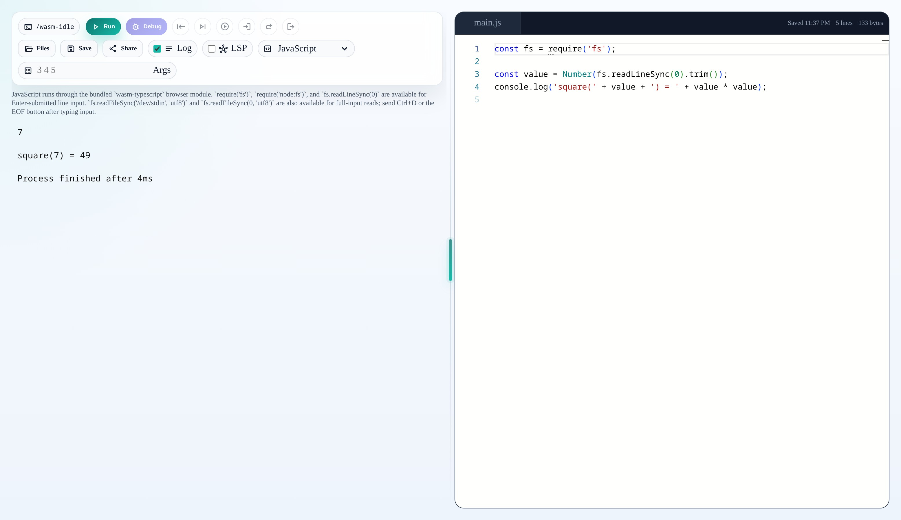

## wasm-idle



Executes C++, Python, Java, Rust, and TinyGo code with working stdio.

Refer to src/lib/clang.

Java uses TeaVM's browser compiler/runtime. TeaVM compiler/runtime/classlib assets are bundled under `static/teavm/` by default, and the asset base URL can be overridden with `PUBLIC_TEAVM_BASE_URL`.

Pyodide core assets are vendored under `static/pyodide/`. Refresh them after bumping the `pyodide`
package with:

```bash
cd wasm-idle
pnpm run sync:pyodide
```

## Rust browser integration

The demo app now bundles a local `wasm-rust` browser compiler under `static/wasm-rust/` and points the example `Terminal` at `/wasm-rust/index.js` by default. Refresh that bundle after rebuilding the sibling `wasm-rust` project with:

```bash
cd wasm-idle
pnpm run sync:wasm-rust
```

The built-in Rust route now supports both `wasm32-wasip1` and `wasm32-wasip2`. The page exposes a
target selector when Rust is active, defaults to `wasm32-wasip1`, and persists that choice in local
storage.

## TinyGo browser integration

The demo app can also vendor the sibling `wasm-tinygo` browser build under `static/wasm-tinygo/`
and load its `runtime.js` entry directly inside the TinyGo playground sandbox. The example page
only auto-discovers a host-assisted `/api/tinygo/compile` endpoint when the browser itself is
running on `localhost` during `vite dev` / `vite preview`. Non-local and static deployments do not
probe that path implicitly anymore; set `PUBLIC_WASM_TINYGO_HOST_COMPILE_URL` or
`runtimeAssets.tinygo.hostCompileUrl` explicitly if you want to use a real TinyGo compile service.
Refresh the
bundled runtime assets after rebuilding the sibling `wasm-tinygo` project with:

```bash
cd wasm-tinygo
npm run build

cd ../wasm-idle
pnpm run sync:wasm-tinygo
```

TinyGo currently exposes a single `wasm` target through the example page. The browser pipeline
still lives inside `wasm-tinygo`; `wasm-idle` now imports its reusable `runtime.js` library entry
directly, then runs the emitted artifact with browser WASI so terminal stdin/EOF behavior stays
consistent with the other runtimes. The bundled browser fallback still exercises the
`wasm-tinygo` front-end/verification pipeline, but it does not yet guarantee a runnable TinyGo
program artifact for arbitrary inputs without an explicit host compile service.

## Browser regression commands

Browser-level Rust and TinyGo checks are reproducible from this repo:

```bash
cd wasm-idle
pnpm run probe:rust-browser
pnpm run test:browser:playwright
pnpm run probe:tinygo-browser
pnpm run test:browser:tinygo

WASM_IDLE_BROWSER_URL='http://localhost:5173/absproxy/5173/' \
WASM_IDLE_REUSE_LOCAL_PREVIEW=1 \
pnpm run probe:rust-browser

WASM_IDLE_BROWSER_URL='http://localhost:5173/absproxy/5173/' \
WASM_IDLE_REUSE_LOCAL_PREVIEW=1 \
pnpm run probe:tinygo-browser

WASM_IDLE_RUN_REAL_BROWSER_RUST=1 \
WASM_IDLE_BROWSER_URL='http://localhost:5173/absproxy/5173/' \
WASM_IDLE_REUSE_LOCAL_PREVIEW=1 \
pnpm exec vitest run src/lib/playground/rust.playwright.test.ts

WASM_IDLE_RUN_REAL_BROWSER_TINYGO=1 \
WASM_IDLE_BROWSER_URL='http://localhost:5173/absproxy/5173/' \
WASM_IDLE_REUSE_LOCAL_PREVIEW=1 \
pnpm exec vitest run src/lib/playground/tinygo.playwright.test.ts
```

Both runtime probes exercise the real Chromium page path. The default Rust probe now feeds stdin with a
single line (`5\n`) and expects the page to finish without sending EOF, which keeps the regression
aligned with the default Rust sample and proves that pressing Enter is enough for line-based stdin.
Programs that intentionally read stdin until EOF can still be finished with `Ctrl+D` or the toolbar
`Send EOF` button while the process is running.
The browser helper writes stdin through the page-owned `window.__wasmIdleDebug.writeTerminalInput(...)`
hook instead of trying to click xterm's hidden helper textarea, which proved too flaky for repeatable
Playwright runs.
The TinyGo probe follows the same pattern and, on the local preview path, still asserts that the
transcript came through the host compile seam by looking for `tinygo host compile ready: target=wasip1`.
The TinyGo browser commands currently default to `vite dev`.
If Rust ever reports `invalid metadata files for crate core` or `Unsupported archive identifier`,
the browser almost always fetched a stale or wrong `wasm-rust` sysroot asset. Hard refresh the page
and resync `static/wasm-rust/` from the sibling `wasm-rust/dist/`.
When browser-rustc does retry, it now emits a visible warning instead of only a debug-level
transition into attempt `2/5`, `3/5`, and so on.
When the Rust `log` option is enabled, those compile-time `wasm-rust` progress and retry lines are
also forwarded into the terminal transcript before the final runtime output, so the browser console
is no longer required to inspect build progress.
They also resync the vendored `wasm-rust` bundle and rebuild `wasm-idle` first, so the browser run is
checked against the current assets rather than a stale preview output.
The probe/test helper also claims a dedicated local preview port by default instead of reusing
whatever already answers on `localhost`, which keeps the regression target tied to the current build.
If you point the probe at `dev.seorii.io`, remember that route currently requires an authenticated
session; the repo-owned regression target is the local preview path above.

## Runtime expectations

Rust still supports an external browser compiler module for library consumers. Point `PUBLIC_WASM_RUST_COMPILER_URL` at a built `wasm-rust` ESM entry such as `.../wasm-rust/dist/index.js`, or pass `runtimeAssets.rust.compilerUrl` at runtime.
TinyGo can use a host compile service when one is configured explicitly. Point
`PUBLIC_WASM_TINYGO_HOST_COMPILE_URL` at an endpoint that accepts `POST { source }` and returns the
compiled wasm artifact payload, or pass `runtimeAssets.tinygo.hostCompileUrl` at runtime. The
bundled browser fallback still expects a browser-loadable `wasm-tinygo` runtime module. Point
`PUBLIC_WASM_TINYGO_MODULE_URL` at a built entry such as `.../wasm-tinygo/dist/runtime.js`, or
pass `runtimeAssets.tinygo.moduleUrl` at runtime. The older `PUBLIC_WASM_TINYGO_APP_URL` /
`runtimeAssets.tinygo.appUrl` document path is still accepted and normalized to `runtime.js`.

The Rust browser path now executes returned artifacts through the target-appropriate runtime inside
the Rust worker:

- `wasm32-wasip1` runs as preview1 core wasm through `@bjorn3/browser_wasi_shim`
- `wasm32-wasip2` runs as a preview2 component through `preview2-shim` plus transpiled `jco` output

The generic `src/lib/clang/app.ts` host remains in place for other runtimes, but Rust now delegates
execution to `wasm-rust` so the selected target and returned artifact format stay aligned.

`Terminal` and `playground(...).load(...)` support either the legacy shared `path`/`rootUrl` or per-runtime asset config:

```ts
import type { PlaygroundRuntimeAssets } from 'wasm-idle';

const runtimeAssets: PlaygroundRuntimeAssets = {
	rootUrl: 'https://cdn.example.com/repl',
	python: {
		loader: async ({ asset }) => ({ url: `https://cdn.example.com/repl/pyodide/${asset}` })
	},
	java: {
		baseUrl: 'https://cdn.example.com/repl/teavm/'
	},
	rust: {
		compilerUrl: 'https://cdn.example.com/wasm-rust/index.js'
	},
	tinygo: {
		hostCompileUrl: 'https://tinygo.example.com/api/compile',
		moduleUrl: 'https://cdn.example.com/wasm-tinygo/runtime.js'
	}
};
```

Python custom loaders receive file names under the Pyodide asset root and can serve both core assets and package files. TeaVM custom loaders receive file names under the TeaVM asset root. Rust expects a browser-loadable compiler module URL; that module is responsible for serving its own nested runtime assets. TinyGo can use either an explicit host compile URL or a browser-loadable runtime module. The host compile path is still the only path that guarantees a real executable TinyGo artifact today; the browser runtime provides the fallback compile backend and its sibling `tools/go-probe.wasm` plus vendored emception assets, but it still stops at a verification-oriented artifact boundary for some programs. TinyGo also accepts a runtime asset loader + pack bundle in `runtimeAssets.tinygo` when you need to serve runtime assets out of a single compressed archive. Compressed TeaVM runtime assets are no longer unpacked inside the library; provide the final file URL or handle decompression in your own loader.

If you want a host app to reuse the same runtime asset configuration for both `<Terminal>` and direct `playground(...)` access, bind it once:

```ts
import Terminal, { createPlaygroundBinding } from 'wasm-idle';

	const wasmIdle = createPlaygroundBinding({
		rootUrl: 'https://cdn.example.com/repl',
		rust: {
			compilerUrl: 'https://cdn.example.com/wasm-rust/index.js'
		},
		tinygo: {
			hostCompileUrl: 'https://tinygo.example.com/api/compile',
			moduleUrl: 'https://cdn.example.com/wasm-tinygo/runtime.js',
			assetPacks: [
				{
					index: 'https://cdn.example.com/wasm-tinygo/runtime-pack/runtime-pack.index.json',
					asset: 'https://cdn.example.com/wasm-tinygo/runtime-pack/runtime-pack.bin',
					fileCount: 12,
					totalBytes: 123456
				}
			]
		}
	});

const sandbox = await wasmIdle.load('PYTHON');
await sandbox.load('print("hi")', false);
```

```svelte
<Terminal {...wasmIdle.terminalProps} bind:terminal />
```

Powered by [wasm-clang](https://github.com/binji/wasm-clang), Pyodide, TeaVM, `wasm-rust`, and
`wasm-tinygo`.
