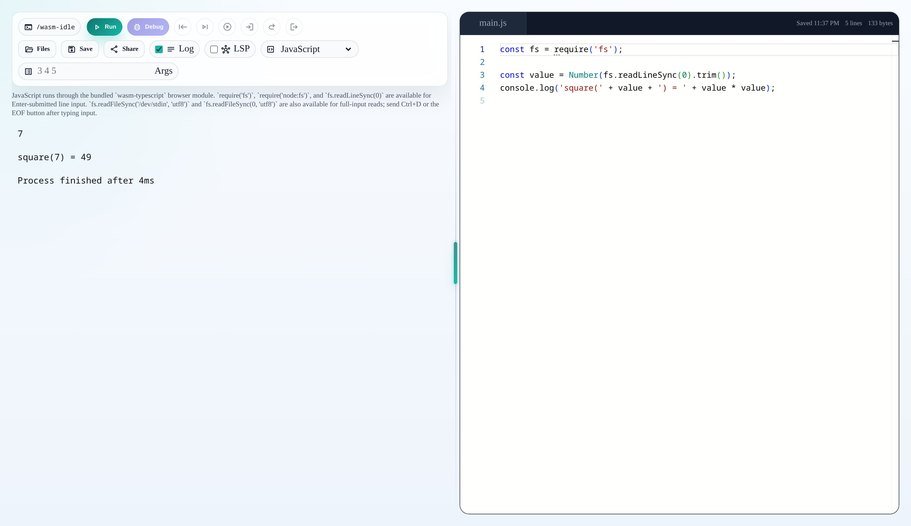

## wasm-idle



Executes C, C++, Objective-C, Fortran, COBOL, Python, Java, Rust, Go, D, C#, F#, VB.NET, Elixir, Erlang, Prolog,
Gleam, Perl, Tcl, AWK, Pascal, Forth, J, BQN, Janet, Julia, Nim, Bash, ClojureScript, OCaml, JavaScript, TypeScript,
AssemblyScript, WAT, WASM, Lua, Zig, Scheme, Ruby, Haskell, R, Octave, SQLite, DuckDB,
and PHP code.

The browser-side C-family host is provided by [`@wasm-idle/llvm-core`](packages/llvm-core).
Compiler source pins, patches, and reproducible asset builds live in
[`seo-rii/wasm-llvm`](https://github.com/seo-rii/wasm-llvm); wasm-idle loads the generated
artifacts from external URLs instead of embedding them in npm packages.

## Language support policy

wasm-idle language support must run user code through the real language implementation in the
browser, normally via a WebAssembly compiler, interpreter, or runtime. Do not add handwritten
parsers, translators, emulators, or "subset" executors as language support. A language should be
listed only after normal user code runs on that actual runtime and stdin/stdout behavior, or a
documented stdin limitation, is covered by tests.

## Support matrix

All execution entries run in the browser through real runtime, compiler, or interpreter
implementations. `Editor support` lists browser LSP/compiler diagnostics when wired; `syntax`
means Monaco syntax highlighting only. C, C++, and `wasm32-wasip1` Rust use the browser LLDB/WAMR
debug runtime; the remaining debug-enabled languages retain wasm-idle's trace controls.

| Language       | Browser runtime/compiler                | Stdin | Editor support       | Debug |
| -------------- | --------------------------------------- | ----- | -------------------- | ----- |
| C              | @wasm-idle/llvm-core / Clang WASI       | Yes   | clangd               | LLDB  |
| C++            | @wasm-idle/llvm-core / Clang WASI       | Yes   | clangd               | LLDB  |
| Objective-C    | GNUstep libobjc2 + @wasm-idle/llvm-core | Yes   | clangd               | Trace |
| Python         | Pyodide                                 | Yes   | Python LSP           | Trace |
| Java           | TeaVM                                   | Yes   | syntax               | -     |
| Rust           | wasm-rust / browser rustc               | Yes   | rustc diagnostics    | LLDB  |
| Go             | wasm-go / browser Go compiler           | Yes   | compiler diagnostics | Trace |
| D              | wasm-d                                  | Yes   | syntax               | -     |
| C#             | wasm-dotnet                             | Yes   | compiler diagnostics | -     |
| F#             | wasm-dotnet                             | Yes   | compiler diagnostics | -     |
| VB.NET         | wasm-dotnet                             | Yes   | compiler diagnostics | -     |
| Elixir         | AtomVM / Popcorn                        | Yes   | syntax               | -     |
| Erlang         | AtomVM / Popcorn                        | Yes   | syntax               | -     |
| Prolog         | SWI-Prolog WASM worker                  | Yes   | syntax               | -     |
| Gleam          | Gleam precompiled browser runtime       | Yes   | compiler diagnostics | -     |
| Perl           | Perl WASM worker                        | Yes   | syntax               | -     |
| Tcl            | Wacl Tcl WASM worker                    | Yes   | syntax               | -     |
| AWK            | GoAWK WASM worker                       | Yes   | syntax               | -     |
| Pascal         | pas2js worker                           | Yes   | syntax               | -     |
| Forth          | WAForth WASM worker                     | Yes   | syntax               | -     |
| J              | J playground WASM worker                | Yes   | syntax               | -     |
| BQN            | CBQN WASM worker                        | Yes   | syntax               | -     |
| Janet          | Janet VM WASM worker                    | Yes   | syntax               | -     |
| Julia          | Julia 1.3.0-DEV.560 legacy WASM worker  | Yes   | syntax               | -     |
| Nim            | Nim 2.2.4 WASM + clang/lld WASM         | Yes   | syntax               | -     |
| Bash           | GNU Bash WASIX / Wasmer SDK             | Yes   | syntax               | -     |
| ClojureScript  | cljs.js self-hosted compiler            | Yes   | syntax               | -     |
| OCaml          | wasm-of-js-of-ocaml / js_of_ocaml       | Yes   | syntax               | -     |
| JavaScript     | wasm-typescript / TypeScript service    | Yes   | TypeScript LSP       | -     |
| TypeScript     | wasm-typescript / TypeScript service    | Yes   | TypeScript LSP       | -     |
| AssemblyScript | AssemblyScript compiler                 | Yes   | AssemblyScript LSP   | -     |
| WAT            | WABT                                    | Yes   | WAT LSP              | -     |
| WASM           | Browser WebAssembly + WASI shim         | Yes   | syntax               | -     |
| Lua            | Wasmoon                                 | Yes   | syntax               | -     |
| Zig            | zig_small.wasm                          | Yes   | syntax               | -     |
| Scheme         | Puppy Scheme / wasm-lisp                | Yes   | syntax               | -     |
| Ruby           | CRuby WASI                              | Yes   | syntax               | -     |
| Haskell        | ghc-in-browser                          | Yes   | syntax               | -     |
| Fortran        | f2c + @wasm-idle/llvm-core              | Yes   | Fortran LSP          | -     |
| COBOL          | GnuCOBOL 3.2 + @wasm-idle/llvm-core     | Yes   | syntax               | -     |
| R              | WebR                                    | Yes   | syntax               | -     |
| Octave         | wasm-octave                             | Yes   | syntax               | -     |
| DuckDB         | DuckDB-Wasm                             | Files | DuckDB LSP           | -     |
| SQLite         | sql.js                                  | n/a   | syntax               | -     |
| PHP            | PHP 8.4 / php-wasm                      | Yes   | syntax               | -     |

## Browser LLDB debug runtime

Normal execution still compiles and instantiates the user module with the browser WebAssembly
engine and the existing WASI host. C, C++, and `wasm32-wasip1` Rust debug sessions use a separate,
lazy-loaded path:

```text
Monaco / debug UI
  ↕ DAP over a SharedArrayBuffer byte stream
LLDB worker (ProcessWasm + DWARF)
  ↕ GDB RSP over a separate SharedArrayBuffer byte stream
WAMR target worker (classic interpreter + source-debug stub)
  ↕
program.wasm + embedded DWARF + WASI
```

The compiler writes stable `/workspace/...` paths and embedded DWARF at `-O0`. The target is loaded
before LLDB attaches; breakpoints and `configurationDone` are completed before WAMR starts the
guest. Program output, input, lifecycle control, DAP, and RSP use separate logical streams.
Breakpoints are retained per source path, so switching between C/C++ workspace files does not leak
line numbers into another file and changes made while compilation is in flight are applied when the
debug target connects.
`@wasm-idle/debug` remains a code-only UI/adapter package, while
`@wasm-idle/llvm-core/debug` owns the browser session and `wasm-llvm` owns the pinned LLDB/WAMR
producers and binary manifests.

Debugging requires `SharedArrayBuffer` and a cross-origin-isolated deployment. The LLDB and WAMR
assets are not downloaded until a supported debug session starts. If the LLDB manifest is absent,
invalid, or does not advertise the required breakpoint/step/stack/local capabilities, the
playground labels that run as a trace fallback and keeps the existing instrumentation debugger
available. Build and verify both producers
using [`producer/lldb-browser`](../wasm-llvm/producer/lldb-browser) and
[`producer/wamr-browser`](../wasm-llvm/producer/wamr-browser), then assemble them with the Clang
release:

Stable v1 is release-qualified on 64-bit desktop Chromium on Linux. It supports one active debug
session for `wasm32-wasi` Preview 1 C/C++ and `wasm32-wasip1` Rust artifacts produced by the
pinned toolchains at `-O0` with embedded DWARF. Debug starts a new, single-threaded WAMR classic
interpreter instance; it does not attach to a browser-engine run or preserve that run's live state,
and runtime-specific behavior can differ. Trace fallback is selected only before an LLDB session is
established; an LLDB or WAMR failure ends that session instead of silently changing debugger
semantics.

Full expression evaluation, conditional/log/data breakpoints, variable mutation, restart,
standalone terminate, optimized-debug guarantees, C++ exception support, STL pretty-printers,
`wasm64`, guest threads, reverse debugging, SIMD, multi-module guests, and Rust WASI Preview 2/3
debugging are outside the v1 support boundary.

```sh
cd ../wasm-llvm
WASM_LLVM_LLDB_ARTIFACT_DIR=/path/to/lldb-artifacts \
WASM_LLVM_WAMR_ARTIFACT_DIR=/path/to/wamr-artifacts \
pnpm prepare:clang-release

cd ../wasm-idle
WASM_RUST_PRODUCER_OUTPUT_ROOT=/path/to/rust-producer-output \
pnpm --dir runtimes/wasm-rust build:producer
pnpm sync:wasm-rust
pnpm sync:wasm-debug ../wasm-llvm/out/clang-browser
WASM_IDLE_BROWSER_SERVER_MODE=dev pnpm test:browser:debug:lldb
```

The synchronized manifest rejects missing hashes, incompatible Clang/LLDB revisions, and stale
worker sidecars. The strict browser test covers real C, C++, and Rust breakpoint, step, output, and
termination paths and rejects trace fallback or a missing debug asset. The Rust producer build is
required for LLDB metadata; the historical split-runtime build intentionally lacks exact compiler
provenance and is rejected instead of starting a potentially incompatible debugger.

### Runtime details

`Package/version base` names the deployed static module or manifest and its producer package,
or the browser-side package/workspace runtime that backs each row. Static ESM entries are page
assets loaded over HTTP on demand, not files embedded in the published npm packages.
`Execution defaults / flags` lists the default
targets and flags wasm-idle applies, plus the public per-run options that change execution.
`Customization` lists the `runtimeAssets` fields and matching `PUBLIC_WASM_*` env overrides
when they exist.

| Language / IDs                     | Package/version base                                                                                                                                                           | Execution defaults / flags                                                                                                                                                                                                                                                                                                                                                                                                                                                                                                                                              | Customization                                                                                                                                                                                                                                                                                                                                    |
| ---------------------------------- | ------------------------------------------------------------------------------------------------------------------------------------------------------------------------------ | ----------------------------------------------------------------------------------------------------------------------------------------------------------------------------------------------------------------------------------------------------------------------------------------------------------------------------------------------------------------------------------------------------------------------------------------------------------------------------------------------------------------------------------------------------------------------- | ------------------------------------------------------------------------------------------------------------------------------------------------------------------------------------------------------------------------------------------------------------------------------------------------------------------------------------------------ |
| C<br>`C`                           | @wasm-idle/llvm-core@1.0.0 / Clang 22.1.8 WASI sysroot from the `wasm-llvm` producer                                                                                           | `clang` for `wasm32-wasi`; default `-std=gnu11`; LLDB mode compiles untouched source with embedded DWARF at `-g -O0` and runs it in WAMR; normal runs still use the browser WASI host; supports `stdin` and `programArgs`                                                                                                                                                                                                                                                                                                                                               | `runtimeAssets.clang.baseUrl`/`loader` or `rootUrl`; `compileArgs`, `programArgs`, `cVersion`, `activePath`, `workspaceFiles`, `debugMode`, `breakpoints`, `pauseOnEntry`                                                                                                                                                                        |
| C++<br>`CPP`                       | @wasm-idle/llvm-core@1.0.0 / Clang 22.1.8 WASI sysroot from the `wasm-llvm` producer                                                                                           | `clang++` for `wasm32-wasi`; default `-std=gnu++2a`; LLDB mode compiles untouched source with embedded DWARF at `-g -O0` and runs it in WAMR; normal runs still use the browser WASI host; supports `stdin` and `programArgs`                                                                                                                                                                                                                                                                                                                                           | `runtimeAssets.clang.baseUrl`/`loader` or `rootUrl`; `compileArgs`, `programArgs`, `cppVersion`, `activePath`, `workspaceFiles`, `debugMode`, `breakpoints`, `pauseOnEntry`                                                                                                                                                                      |
| Objective-C<br>`OBJC`              | GNUstep libobjc2 v2.3 assets from the `wasm-llvm` producer + @wasm-idle/llvm-core@1.0.0                                                                                        | `clang -x objective-c -fobjc-runtime=gnustep-2.0 -fblocks` for `wasm32-wasi`; links `libobjc.a`, `libgnustep-base.a`, and `libffi.a` when Foundation is imported; Foundation headers are inlined from `foundation-headers.json`; includes a constructor wrapper for Objective-C class registration; auto-compiles `.m`/`.mm`/`.c` workspace files; trace debug instruments active source and uses wasm-idle controls; supports `stdin` and `programArgs`; large Objective-C assets may be served as gzip-only `.gz` files through the service worker or worker fallback | `runtimeAssets.objectivec.baseUrl`/`libobjcUrl`/`headersUrl`/`libgnustepBaseUrl`/`libgnustepBaseObjectUrl`/`foundationHeadersUrl`/`libffiUrl` or `PUBLIC_WASM_OBJECTIVEC_*`; `runtimeAssets.clang.baseUrl`/`loader` for the clang toolchain; `activePath`, `workspaceFiles`, `compileArgs`, `debug`, `breakpoints`, `pauseOnEntry`               |
| Python<br>`PYTHON3`                | static ESM `static/pyodide/pyodide.mjs` / pyodide@0.29.3                                                                                                                       | loads `pyodide.mjs`, `pyodide.asm.js`, `pyodide.asm.wasm`, and `python_stdlib.zip` from the configured static asset tree on demand; supports `stdin`, workspace files, and trace debugging                                                                                                                                                                                                                                                                                                                                                                              | `runtimeAssets.python.baseUrl`/`loader` or `rootUrl`; `stdin`, `activePath`, `workspaceFiles`, `debug`, `breakpoints`, `pauseOnEntry`, `debugPath`                                                                                                                                                                                               |
| Java<br>`JAVA`                     | @wasm-idle/runtime-teavm@0.0.0 / TeaVM compiler assets                                                                                                                         | `compiler.wasm` compiles Java to browser WASM/JS; supports `stdin` and `programArgs`                                                                                                                                                                                                                                                                                                                                                                                                                                                                                    | `runtimeAssets.java.baseUrl`/`loader` or `rootUrl`                                                                                                                                                                                                                                                                                               |
| Rust<br>`RUST`                     | wasm-rust@0.1.0 / rust-1.99.0-browser-integrated-v1 + integrated LLVM/LLD 22.1.8 from the `wasm-llvm` producer; exact rustc/LLVM provenance is recorded for LLDB compatibility | browser host `wasm32-wasip1-threads`; default target `wasm32-wasip1`, selectable `wasm32-wasip1`, `wasm32-wasip2`, `wasm32-wasip3`; LLDB mode is currently limited to `wasm32-wasip1` and emits embedded DWARF with `-C debuginfo=2 -C opt-level=0`; normal Preview 1/2/3 execution remains unchanged; supports `stdin` and `programArgs`                                                                                                                                                                                                                               | `runtimeAssets.rust.compilerUrl`, `runtimeAssets.rust.debugModuleUrl`, or `PUBLIC_WASM_RUST_COMPILER_URL`; `rootUrl`, `rustTargetTriple`, `programArgs`, `debugMode`; compiler requests accept `edition`, `crateType`, `extendedTimeout`, `log`, and `onProgress`; runtime manifest controls compiler memory, timeout, and shared workspace size |
| Go<br>`GO`                         | wasm-go@0.1.0 / go1.26.1                                                                                                                                                       | default target `wasip1/wasm`; selectable `wasip1/wasm`, `wasip2/wasm`, `wasip3/wasm`, `js/wasm`; supports `stdin` and `programArgs`                                                                                                                                                                                                                                                                                                                                                                                                                                     | `runtimeAssets.go.compilerUrl` or `PUBLIC_WASM_GO_COMPILER_URL`; `goTarget`, `programArgs`                                                                                                                                                                                                                                                       |
| D<br>`D`                           | wasm-d@0.1.0 / ldc-1.42.0-wasi-smoke                                                                                                                                           | `ldc2 -conf=/toolchain/etc/ldc2.conf -mtriple=wasm32-wasi -c` then `wasm-ld` to WASI preview1; supports `stdin` and `programArgs`                                                                                                                                                                                                                                                                                                                                                                                                                                       | `runtimeAssets.d.moduleUrl` or `PUBLIC_WASM_D_MODULE_URL`; `activePath`, `programArgs`                                                                                                                                                                                                                                                           |
| C#<br>`CSHARP`                     | wasm-dotnet@0.1.0 / .NET 9.0.16 browser-wasm / Roslyn C# 4.14.0                                                                                                                | `CSharpCompilationOptions(OutputKind.ConsoleApplication)`; `concurrentBuild=false`; target `browser-wasm`; language-specific AOT bundle `runtime/csharp/`; supports `stdin` and `programArgs`                                                                                                                                                                                                                                                                                                                                                                           | `runtimeAssets.dotnet.moduleUrl` or `PUBLIC_WASM_DOTNET_MODULE_URL`; `programArgs`, LSP on/off                                                                                                                                                                                                                                                   |
| F#<br>`FSHARP`                     | wasm-dotnet@0.1.0 / .NET 9.0.16 browser-wasm / FCS 43.12.204 / FSharp.Core 10.1.204                                                                                            | `fsc.exe --target:exe --targetprofile:netcore --noframework --simpleresolution --nowin32manifest --debug- --optimize-`; language-specific AOT bundle `runtime/fsharp/`; supports `stdin` and `programArgs`                                                                                                                                                                                                                                                                                                                                                              | `runtimeAssets.dotnet.moduleUrl` or `PUBLIC_WASM_DOTNET_MODULE_URL`; `programArgs`, LSP on/off                                                                                                                                                                                                                                                   |
| VB.NET<br>`VBNET`                  | wasm-dotnet@0.1.0 / .NET 9.0.16 browser-wasm / Roslyn Visual Basic 4.14.0                                                                                                      | `VisualBasicCompilationOptions(OutputKind.ConsoleApplication)`; `concurrentBuild=false`, `OptionStrict=Off`, `OptionInfer=On`, `OptionExplicit=On`; target `browser-wasm`; language-specific AOT bundle `runtime/vbnet/`; supports `stdin` and `programArgs`                                                                                                                                                                                                                                                                                                            | `runtimeAssets.dotnet.moduleUrl` or `PUBLIC_WASM_DOTNET_MODULE_URL`; `programArgs`, LSP on/off                                                                                                                                                                                                                                                   |
| Elixir<br>`ELIXIR`                 | wasm-elixir asset bundle / @swmansion/popcorn@0.2.2                                                                                                                            | Popcorn/AtomVM bundle `bundle.avm`; supports `stdin`                                                                                                                                                                                                                                                                                                                                                                                                                                                                                                                    | `runtimeAssets.elixir.bundleUrl` or `PUBLIC_WASM_ELIXIR_BUNDLE_URL`                                                                                                                                                                                                                                                                              |
| Erlang<br>`ERLANG`                 | wasm-elixir asset bundle / @swmansion/popcorn@0.2.2                                                                                                                            | Popcorn/AtomVM bundle `bundle.avm`; supports `stdin`                                                                                                                                                                                                                                                                                                                                                                                                                                                                                                                    | `runtimeAssets.erlang.bundleUrl` or `PUBLIC_WASM_ERLANG_BUNDLE_URL`; falls back to Elixir bundle URL                                                                                                                                                                                                                                             |
| Prolog<br>`PROLOG`                 | swipl-wasm@8.0.1 synced into `static/wasm-prolog`                                                                                                                              | static worker runs SWI-Prolog; supports `stdin` and `programArgs`                                                                                                                                                                                                                                                                                                                                                                                                                                                                                                       | `runtimeAssets.prolog.baseUrl`/`runtimeAssets.prolog.workerUrl` or `PUBLIC_WASM_PROLOG_BASE_URL`/`PUBLIC_WASM_PROLOG_WORKER_URL`; `programArgs`, `activePath`, `workspaceFiles`                                                                                                                                                                  |
| Gleam<br>`GLEAM`                   | @live-codes/gleam-precompiled@0.5.0 static worker                                                                                                                              | Gleam worker compiles/runs browser output with source manifest; supports `stdin`                                                                                                                                                                                                                                                                                                                                                                                                                                                                                        | `runtimeAssets.gleam.baseUrl`/`workerUrl`/`manifestUrl` or `PUBLIC_WASM_GLEAM_*`; `programArgs`, `workspaceFiles`                                                                                                                                                                                                                                |
| Perl<br>`PERL`                     | WebPerl v0.09-beta (webperl_prebuilt_v0.09-beta.zip)                                                                                                                           | host-verifies the manifest, stored assets, logical hashes, and profile-bound one-shot runner before executing `emperl`; supports `stdin` and `programArgs`                                                                                                                                                                                                                                                                                                                                                                                                              | explicit `runtimeAssets.perl.baseUrl`/`workerUrl`/`manifestUrl` overrides require one complete profile-and-runner receipt bundle; URL-only `PUBLIC_WASM_PERL_*` overrides fail closed; `programArgs`, `activePath`, `workspaceFiles`                                                                                                             |
| Tcl<br>`TCL`                       | Wacl Tcl 2017-05-29 (wacl.zip)                                                                                                                                                 | host-verifies the manifest, stored assets, logical hashes, and profile-bound one-shot runner before executing Wacl Tcl; supports `stdin` and `programArgs`                                                                                                                                                                                                                                                                                                                                                                                                              | bundled mirrors may set `runtimeAssets.tcl.baseUrl`/`workerUrl`/`manifestUrl` or `PUBLIC_WASM_TCL_BASE_URL`/`PUBLIC_WASM_TCL_WORKER_URL`; custom executable bytes require one complete profile-and-runner receipt bundle; `programArgs`, `activePath`, `workspaceFiles`                                                                          |
| AWK<br>`AWK`                       | GoAWK v1.31.0 / go1.25.3                                                                                                                                                       | static worker runs `goawk.wasm`; supports `stdin` and `programArgs`                                                                                                                                                                                                                                                                                                                                                                                                                                                                                                     | `runtimeAssets.awk.baseUrl`/`runtimeAssets.awk.workerUrl` or `PUBLIC_WASM_AWK_BASE_URL`/`PUBLIC_WASM_AWK_WORKER_URL`; `programArgs`, `activePath`, `workspaceFiles`                                                                                                                                                                              |
| Pascal<br>`PASCAL`                 | pas2js 3.2.1 (9ac46614dc82)                                                                                                                                                    | static worker compiles with pas2js then runs JS; supports `stdin`                                                                                                                                                                                                                                                                                                                                                                                                                                                                                                       | `runtimeAssets.pascal.baseUrl`/`runtimeAssets.pascal.workerUrl` or `PUBLIC_WASM_PASCAL_BASE_URL`/`PUBLIC_WASM_PASCAL_WORKER_URL`; `programArgs`, `activePath`, `workspaceFiles`                                                                                                                                                                  |
| Forth<br>`FORTH`                   | waforth@0.20.1 / static worker                                                                                                                                                 | WAForth worker; supports `stdin` and `programArgs`                                                                                                                                                                                                                                                                                                                                                                                                                                                                                                                      | `runtimeAssets.forth.baseUrl`/`runtimeAssets.forth.workerUrl` or `PUBLIC_WASM_FORTH_BASE_URL`/`PUBLIC_WASM_FORTH_WORKER_URL`; `programArgs`, `activePath`, `workspaceFiles`                                                                                                                                                                      |
| J<br>`J`                           | jsoftware-j-playground static worker                                                                                                                                           | J playground worker; supports `stdin` and `programArgs`                                                                                                                                                                                                                                                                                                                                                                                                                                                                                                                 | `runtimeAssets.j.baseUrl`/`runtimeAssets.j.workerUrl` or `PUBLIC_WASM_J_BASE_URL`/`PUBLIC_WASM_J_WORKER_URL`; `programArgs`, `activePath`, `workspaceFiles`                                                                                                                                                                                      |
| BQN<br>`BQN`                       | CBQN static worker / Emscripten 3.1.8                                                                                                                                          | CBQN worker; supports `stdin` and `programArgs`                                                                                                                                                                                                                                                                                                                                                                                                                                                                                                                         | `runtimeAssets.bqn.baseUrl`/`runtimeAssets.bqn.workerUrl` or `PUBLIC_WASM_BQN_BASE_URL`/`PUBLIC_WASM_BQN_WORKER_URL`; `programArgs`, `activePath`, `workspaceFiles`                                                                                                                                                                              |
| Janet<br>`JANET`                   | Janet 1.41.3-dev / Emscripten 3.1.8 opaque vendored bundle                                                                                                                     | host-verifies the manifest, stored assets, logical hashes, and profile-bound one-shot runner before executing the Janet VM; supports `stdin` and `programArgs`                                                                                                                                                                                                                                                                                                                                                                                                          | explicit `runtimeAssets.janet.baseUrl`/`workerUrl`/`manifestUrl` overrides require one complete profile-and-runner receipt bundle; URL-only `PUBLIC_WASM_JANET_*` overrides fail closed; `programArgs`, `activePath`, `workspaceFiles`                                                                                                           |
| Julia<br>`JULIA`                   | @chriskoch/julia-wasm@1.0.4                                                                                                                                                    | Julia WASM worker; supports `stdin` and `programArgs`                                                                                                                                                                                                                                                                                                                                                                                                                                                                                                                   | `runtimeAssets.julia.baseUrl`/`runtimeAssets.julia.workerUrl` or `PUBLIC_WASM_JULIA_BASE_URL`/`PUBLIC_WASM_JULIA_WORKER_URL`; `programArgs`, `activePath`, `workspaceFiles`                                                                                                                                                                      |
| Nim<br>`NIM`                       | Nim 2.2.4 / benagastov Nim-WASM-Compiler with clang/lld WASM                                                                                                                   | static worker compiles Nim to C, then clang/lld to WASM; supports `stdin`                                                                                                                                                                                                                                                                                                                                                                                                                                                                                               | `runtimeAssets.nim.baseUrl`/`runtimeAssets.nim.workerUrl` or `PUBLIC_WASM_NIM_BASE_URL`/`PUBLIC_WASM_NIM_WORKER_URL`; `programArgs`, `activePath`, `workspaceFiles`                                                                                                                                                                              |
| Bash<br>`BASH`                     | @wasm-idle/runtime-bash@0.1.0 / GNU Bash WASIX + static ESM `static/wasm-bash/sdk/index.mjs` produced from @wasmer/sdk@0.9.0                                                   | runs the pinned `bash.webc` locally through the on-demand Wasmer SDK asset; invokes `bash -c <code> <activePath> ...programArgs` and supports `stdin`, `programArgs`, `activePath`, and `workspaceFiles`                                                                                                                                                                                                                                                                                                                                                                | `runtimeAssets.bash.moduleUrl`/`workerUrl`/`webcUrl` or `rootUrl`; `stdin`, `programArgs`, `activePath`, `workspaceFiles`                                                                                                                                                                                                                        |
| ClojureScript<br>`CLOJURESCRIPT`   | @wasm-idle/runtime-clojurescript@0.1.0 / ClojureScript 1.12.134                                                                                                                | static worker compiles and evaluates with the official `cljs.js` self-hosted compiler; supports `stdin`, `programArgs`, `activePath`, and `workspaceFiles`                                                                                                                                                                                                                                                                                                                                                                                                              | `runtimeAssets.clojurescript.baseUrl`/`runtimeAssets.clojurescript.workerUrl` or `PUBLIC_WASM_CLOJURESCRIPT_BASE_URL`/`PUBLIC_WASM_CLOJURESCRIPT_WORKER_URL`; `programArgs`, `activePath`, `workspaceFiles`                                                                                                                                      |
| OCaml<br>`OCAML`                   | wasm-of-js-of-ocaml@0.1.0 / js_of_ocaml + wasm_of_ocaml                                                                                                                        | default backend `wasm`; selectable `wasm`, `js`; `ocamlWasmBinaryenMode` `fast`, `full`; supports `stdin`                                                                                                                                                                                                                                                                                                                                                                                                                                                               | `runtimeAssets.ocaml.moduleUrl`/`manifestUrl` or `PUBLIC_WASM_OCAML_*`; `ocamlBackend`                                                                                                                                                                                                                                                           |
| JavaScript<br>`JAVASCRIPT`         | wasm-typescript@0.1.0 / @swc/wasm-typescript@1.15.33                                                                                                                           | TypeScript service transpiles JS/TS and runs in browser sandbox; supports `stdin` and `programArgs`                                                                                                                                                                                                                                                                                                                                                                                                                                                                     | `runtimeAssets.typescript.moduleUrl`/`libUrl` or `PUBLIC_WASM_TYPESCRIPT_MODULE_URL`                                                                                                                                                                                                                                                             |
| TypeScript<br>`TYPESCRIPT`         | wasm-typescript@0.1.0 / @swc/wasm-typescript@1.15.33                                                                                                                           | TypeScript service transpiles then runs in browser sandbox; supports `stdin` and `programArgs`                                                                                                                                                                                                                                                                                                                                                                                                                                                                          | `runtimeAssets.typescript.moduleUrl`/`libUrl` or `PUBLIC_WASM_TYPESCRIPT_MODULE_URL`                                                                                                                                                                                                                                                             |
| AssemblyScript<br>`ASSEMBLYSCRIPT` | static ESM `static/wasm-assemblyscript/runtime.mjs` produced from assemblyscript@0.28.17 + @assemblyscript/loader@0.28.17                                                      | `asc <activePath> --outFile module.wasm --runtime incremental --bindings raw --optimize --exportRuntime`; runs the emitted WASM through WASI/browser imports and supports `stdin`                                                                                                                                                                                                                                                                                                                                                                                       | `runtimeAssets.assemblyscript.moduleUrl` or `PUBLIC_WASM_ASSEMBLYSCRIPT_MODULE_URL` or `rootUrl`; `stdin`, `activePath`, `workspaceFiles`                                                                                                                                                                                                        |
| WAT<br>`WAT`                       | wasm-wat@0.1.0 / wabt@1.0.39                                                                                                                                                   | WABT parses WAT to WASM then runs through WASI shim; supports `stdin` and `programArgs`                                                                                                                                                                                                                                                                                                                                                                                                                                                                                 | `runtimeAssets.wat.moduleUrl` or `PUBLIC_WASM_WAT_MODULE_URL`; `programArgs`                                                                                                                                                                                                                                                                     |
| WASM<br>`WASM`                     | Browser WebAssembly + @bjorn3/browser_wasi_shim@0.4.2                                                                                                                          | loads provided WASM bytes and executes with WASI preview1 imports; supports `stdin` and `programArgs`                                                                                                                                                                                                                                                                                                                                                                                                                                                                   | `programArgs`, `stdin`, `activePath`                                                                                                                                                                                                                                                                                                             |
| Lua<br>`LUA`                       | wasm-lua@0.1.0 / wasmoon@1.16.0                                                                                                                                                | Wasmoon Lua VM; supports `stdin` and `programArgs`                                                                                                                                                                                                                                                                                                                                                                                                                                                                                                                      | `runtimeAssets.lua.moduleUrl` or `PUBLIC_WASM_LUA_MODULE_URL`; `programArgs`                                                                                                                                                                                                                                                                     |
| Zig<br>`ZIG`                       | static wasm-zig assets / `zig_small.wasm` + `std.tar.gz`                                                                                                                       | native gzip delivery for the tar standard library; default target `wasm64-wasi`; Zig compile args are appended; supports `stdin`, `compileArgs`, `programArgs`                                                                                                                                                                                                                                                                                                                                                                                                          | `runtimeAssets.zig.compilerUrl`/`stdlibUrl` or `PUBLIC_WASM_ZIG_*`; `zigTargetTriple`, `activePath`, `workspaceFiles`                                                                                                                                                                                                                            |
| Scheme<br>`LISP`                   | wasm-lisp@0.1.0 / Puppy Scheme WASM component                                                                                                                                  | receipt-verified Puppy Scheme compiler/runtime; supports `stdin` and `programArgs`                                                                                                                                                                                                                                                                                                                                                                                                                                                                                      | `runtimeAssets.lisp.{moduleUrl,manifestUrl,manifestFingerprint}` or `PUBLIC_WASM_LISP_{MODULE_URL,MANIFEST_URL,MANIFEST_FINGERPRINT}`; `programArgs`                                                                                                                                                                                             |
| Ruby<br>`RUBY`                     | static ESM `static/wasm-ruby/runtime.mjs` produced from @ruby/3.4-wasm-wasi@2.9.3-2.9.4 + @ruby/wasm-wasi@2.9.3-2.9.4                                                          | CRuby 3.4 WASI runtime loads `ruby+stdlib.wasm` on demand; supports `stdin`, `programArgs`, and workspace files                                                                                                                                                                                                                                                                                                                                                                                                                                                         | `runtimeAssets.ruby.moduleUrl`/`wasmUrl` or `PUBLIC_WASM_RUBY_MODULE_URL`/`PUBLIC_WASM_RUBY_WASM_URL` or `rootUrl`; `stdin`, `programArgs`, `workspaceFiles`                                                                                                                                                                                     |
| Haskell<br>`HASKELL`               | ghc-in-browser / GHC 9.14.0.20251031 WASI rootfs                                                                                                                               | loads `dyld.mjs`, `rootfs.tar.zst`, `bsdtar.wasm`; `compileArgs` become GHC args, otherwise legacy `args` become GHC args                                                                                                                                                                                                                                                                                                                                                                                                                                               | `runtimeAssets.haskell.moduleUrl`/`rootfsUrl`/`bsdtarUrl`; `mainSoPath`, `searchDirs`, `activePath`, `workspaceFiles`                                                                                                                                                                                                                            |
| Fortran<br>`FORTRAN`               | Netlib f2c 2022-09-09 + `@cowasm/f2c 1.0.0` libf2c + @wasm-idle/llvm-core@1.0.0                                                                                                | runs `f2c.wasm` in WASI, compiles generated C with the llvm-core Clang host, links `libf2c.a`, then executes the resulting WASI module with `stdin` and `programArgs`                                                                                                                                                                                                                                                                                                                                                                                                   | `runtimeAssets.fortran.baseUrl`/`f2cWasmUrl`/`libf2cUrl`/`f2cHeaderUrl`/`analyzerUrl` or `PUBLIC_WASM_FORTRAN_*`; `runtimeAssets.clang.baseUrl`/`loader` for the C backend; `activePath`, `workspaceFiles`, `compileArgs`                                                                                                                        |
| COBOL<br>`COBOL`                   | GnuCOBOL 3.2 + GMP 6.3.0 assets from the `wasm-llvm` producer + @wasm-idle/llvm-core@1.0.0                                                                                     | native gzip delivery for the frontend Wasm and filesystem tar assets; translates free-format COBOL with the real GnuCOBOL `cobc` frontend, compiles the generated C with the llvm-core Clang host, links libcob/GMP, and executes the resulting WASI module with `stdin` and `programArgs`                                                                                                                                                                                                                                                                              | `runtimeAssets.cobol.baseUrl` or `PUBLIC_WASM_COBOL_BASE_URL`; `runtimeAssets.clang.baseUrl`/`loader` for the C backend; `activePath`, `workspaceFiles`, `compileArgs`                                                                                                                                                                           |
| R<br>`R`                           | versioned static `static/webr/<hash>/webr.js` / webr@0.6.0                                                                                                                     | loads the browser ESM entry `webr.js` and its WebR runtime files from the configured static asset tree on demand; supports `stdin`, `programArgs`, and workspace files                                                                                                                                                                                                                                                                                                                                                                                                  | `runtimeAssets.r.baseUrl` or `PUBLIC_WASM_R_BASE_URL`; `stdin`, `programArgs`, `activePath`, `workspaceFiles`                                                                                                                                                                                                                                    |
| Octave<br>`OCTAVE`                 | Octave 10.3.0 (octave-10.3.0-pl5321h996e327_3.tar.bz2)                                                                                                                         | Octave CLI Emscripten worker; supports `stdin` and `programArgs`                                                                                                                                                                                                                                                                                                                                                                                                                                                                                                        | `runtimeAssets.octave.baseUrl`/`workerUrl`/`manifestUrl` or `PUBLIC_WASM_OCTAVE_*`                                                                                                                                                                                                                                                               |
| DuckDB<br>`DUCKDB`                 | static ESM `static/wasm-duckdb/runtime.mjs` produced from @duckdb/duckdb-wasm@1.33.1-dev45.0                                                                                   | selects the best DuckDB-Wasm MVP/EH bundle on demand and creates a fresh in-memory database per run; `stdin` is registered as `stdin.txt` and `/dev/stdin` rather than terminal stdin                                                                                                                                                                                                                                                                                                                                                                                   | `runtimeAssets.duckdb.moduleUrl` or `PUBLIC_WASM_DUCKDB_MODULE_URL` or `rootUrl`; `stdin`, `activePath`, `workspaceFiles`                                                                                                                                                                                                                        |
| SQLite<br>`SQLITE`                 | static ESM `static/wasm-sqlite/runtime.mjs` produced from sql.js@1.14.1                                                                                                        | sql.js loads `sql-wasm.wasm` on demand and executes SQL in a fresh in-memory database; terminal stdin is not applicable                                                                                                                                                                                                                                                                                                                                                                                                                                                 | `runtimeAssets.sqlite.moduleUrl`/`wasmUrl` or `PUBLIC_WASM_SQLITE_MODULE_URL`/`PUBLIC_WASM_SQLITE_WASM_URL` or `rootUrl`; `workspaceFiles`                                                                                                                                                                                                       |
| PHP<br>`PHP`                       | static ESM `static/wasm-php/runtime.mjs` prebuilt by the standalone `producers/wasm-php` producer from @php-wasm/web-8-4@3.1.34 + @php-wasm/universal@3.1.34                   | fixed PHP `8.4` php-wasm runtime; injects `$argv`/`$argc` and runs the active workspace script with `php.run`; supports `stdin` and `programArgs`; there is no runtime version selector                                                                                                                                                                                                                                                                                                                                                                                 | `runtimeAssets.php.moduleUrl` or `PUBLIC_WASM_PHP_MODULE_URL` or `rootUrl`; `stdin`, `programArgs`, `activePath`, `workspaceFiles`                                                                                                                                                                                                               |

### Blocked candidates

These languages are intentionally not part of the execution support matrix yet. They should stay
out of `supportedLanguages` until the blocker is resolved with a real browser runtime/compiler and
stdin/stdout coverage.

| Candidate      | Candidate IDs | Current evidence                                                                                                                                                                                                 | Blocker                                                                                                                                                                                  | Required follow-up                                                                                                                                                            |
| -------------- | ------------- | ---------------------------------------------------------------------------------------------------------------------------------------------------------------------------------------------------------------- | ---------------------------------------------------------------------------------------------------------------------------------------------------------------------------------------- | ----------------------------------------------------------------------------------------------------------------------------------------------------------------------------- |
| TinyGo         | `TINYGO`      | `runtimes/wasm-tinygo` keeps its wasm-idle-authored Go AST-to-C subset isolated from a source-pinned upstream TinyGo 0.40.1 path that passed the same 45-package CGo/C/C++/assembly fixture in Node and Chromium | Hosted C++, general assembly, custom native/linker flags, offline external modules, hard synchronous-phase resource limits, and broader differential coverage remain unresolved          | Define the remaining native-language policies, enforce worker resource limits, and expand differential fixtures before restoring TINYGO to the public registry                |
| Modern Fortran | `F90`, `F95`  | `FORTRAN` now runs through f2c/libf2c, while `static/wasm-fortran` still packages LFortran analyzer assets                                                                                                       | LFortran WASM/WAT stdin codegen still aborts and the C backend reports `visit_FileRead() not implemented`; f2c covers Fortran 77-style code but is not a full modern Fortran compiler    | Package a real browser modern Fortran compiler/runtime with stdin-capable codegen before advertising F90/F95 as first-class runtimes                                          |
| Crystal        | `CRYSTAL`     | No browser Crystal compiler/runtime assets are packaged in this repository                                                                                                                                       | Crystal cannot be treated as syntax-only or as a wasm-idle-authored translator/subset                                                                                                    | Find or build a browser-hosted real Crystal compiler/runtime path with stdin/stdout coverage before registering the language                                                  |
| Swift          | `SWIFT`       | Swift.org documents Wasm support through a native Swift 6.x toolchain plus a Wasm SDK, and SwiftWasm Pad uses a backend compile service; no browser-hosted swiftc/SwiftPM runtime asset is packaged here         | Swift cannot be implemented as a wasm-idle-authored parser/runtime subset or as a remote compile service; the playground needs a redistributable browser-hosted real Swift compiler path | Build or source a browser-hosted Swift compiler/SwiftPM runtime bundle, prove stdin/stdout execution for generated WASI modules, then register SWIFT as a first-class runtime |

## Monorepo layout

`wasm-idle` is managed as a pnpm workspace. Language-independent app code remains here while large
toolchains can be consumed from pinned external runtime repositories:

- `packages/core`: framework-neutral contracts, runtime asset keys, progress helpers, and playground
  binding helpers.
- `packages/debug`: optional debug session controller, language adapters, expression helpers, and
  Monaco integration built on the contracts from `@wasm-idle/core`.
- `packages/llvm-core`: code-only browser hosts for shared memory, MemFS, tar, WASI, Clang, COBOL,
  and Objective-C execution. Every compiler, sysroot, archive, and worker asset is supplied through
  an explicit HTTP(S) URL.
- `packages/lsp`: code-only browser language-server hosts. TypeScript libraries, SQL engines,
  clangd, and other language-tool assets are supplied through explicit runtime URLs.
- [`seo-rii/wasm-llvm`](https://github.com/seo-rii/wasm-llvm): external producer repository for compiler source pins, patches, reproducible builds,
  manifests, and asset verification. Its `producer/rust-browser` source build owns the current Rust
  1.99 compiler, matching LLVM 22 code generator, and in-process LLD; it is not consumed as an npm
  runtime package.
- `packages/svelte`: Svelte store/binding helpers around `@wasm-idle/core`.
- `packages/terminal`: optional Svelte/xterm terminal UI that consumes an injected playground
  binding without adding browser UI dependencies to the root runtime package.
- `packages/react`: React hooks around `@wasm-idle/core`.
- `packages/vue`: Vue composables around `@wasm-idle/core`.
- `packages/node`: Node.js host helpers for Node-capable sandbox loaders.
- `runtimes/*`: imported runtime/compiler packages such as `wasm-rust`,
  `wasm-of-js-of-ocaml`, `wasm-go`, `wasm-dotnet`, `wasm-typescript`,
  `wasm-wat`, `wasm-lua`, `wasm-lisp`, `wasm-elixir`, `wasm-tcl`, `wasm-awk`,
  `wasm-forth`, `wasm-j`, `wasm-bqn`, `wasm-janet`,
  `pyodide`, `teavm`, `assemblyscript`, `ruby`, `r`, and `js-sandbox`.
- `runtimes/wasm-tinygo`: an internal harness containing an explicitly labeled legacy AST-to-C
  subset and an independent receipt-verified upstream compiler consumer. `TINYGO` remains
  unregistered pending hosted-C++ and general-assembly policy, offline modules, hard phase limits,
  and broader differential fixtures.
- `producers/wasm-php`: standalone, locked producer for the checked-in PHP 8.4 page asset. It is
  outside the root workspace and is never published as an npm package.
- `static/wasm-zig`, `static/wasm-haskell`, `static/wasm-julia`, and `static/wasm-nim`: bundled browser runtime and
  compiler assets synced from
  upstream asset builds rather than local workspace packages.
- `tools/*`: migrated local toolchain projects that are too broad or infrastructure-heavy to run as
  normal runtime workspace packages. `tools/dool` contains the Docker judge backend for Elixir and
  the other server-side language runners.

Useful workspace commands:

```bash
pnpm workspace:list
pnpm build:packages
pnpm check:packages
pnpm build:runtimes
pnpm check:runtimes
pnpm sync:runtime list
pnpm sync:runtimes
```

The runtime sync scripts default to `runtimes/<name>/dist`; optional source and target arguments are
for alternate build directories inside the current checkout. PHP is the exception:
`sync:wasm-php` consumes `producers/wasm-php/dist` or `WASM_IDLE_WASM_PHP_DIST`.

Published packages are built in workspace dependency order. Before publishing, run:

```bash
pnpm verify:package
```

The smoke check packs the root library and its public workspace dependencies, installs the tarballs
into a temporary project, and imports each public entry point.

Package-backed browser runtimes are converted into page-owned static ESM assets with:

```bash
pnpm run build:static-runtime-modules
```

This producer step writes `runtime.mjs` trees under `static/wasm-assemblyscript/`,
`static/wasm-duckdb/`, `static/wasm-ruby/`, and `static/wasm-sqlite/`. It also writes the Wasmer SDK
module, worker, and WASM payload under `static/wasm-bash/sdk/`. The browser loads each module on
demand when its language is selected; these files are deployed page assets, not npm package
contents.

PHP is built independently under `producers/wasm-php`, with its own lockfile and exact
`@php-wasm/web-8-4@3.1.34` and `@php-wasm/universal@3.1.34` dependencies. Refresh the checked-in
page asset only when changing that producer:

```bash
pnpm --dir producers/wasm-php install --frozen-lockfile
pnpm --dir producers/wasm-php build
pnpm --dir producers/wasm-php verify
pnpm run sync:wasm-php
pnpm run build:static-runtime-modules
pnpm run compress:static-runtimes
```

`build:static-runtime-modules` regenerates the shared module cache key after the PHP manifest
changes, but validates rather than rebuilds PHP. `page:build` neither installs nor bundles PHP
packages; it validates the manifest, logical byte sizes, and SHA-256 hashes of the checked-in
`static/wasm-php/` output before consuming it. The runtime exposes PHP 8.4 only; there is no runtime
PHP version selector.

Java uses TeaVM's browser compiler/runtime. TeaVM compiler/runtime/classlib assets are bundled under `static/teavm/` by default, and the asset base URL can be overridden with `PUBLIC_TEAVM_BASE_URL`.

Pyodide's `pyodide.mjs` and core assets are served from `static/pyodide/` and loaded on demand by
both Python execution and Python LSP workers. Refresh them after bumping the `pyodide` package with:

```bash
cd wasm-idle
pnpm run sync:pyodide
```

WebR's browser ESM entry `webr.js` and runtime files are served from a fingerprinted directory under
`static/webr/`. R execution and R LSP workers share that static asset tree. Refresh it after
bumping `webr` with:

```bash
cd wasm-idle
pnpm run sync:webr
```

Elixir and Erlang browser execution use an AtomVM/Popcorn AVM bundle. The Popcorn `eval-in-wasm`
source and vendored Popcorn Elixir build dependency now live under `runtimes/wasm-elixir/`;
rebuild and sync with:

```bash
cd wasm-idle
pnpm --dir runtimes/wasm-elixir run bundle
pnpm run sync:wasm-elixir
```

Erlang support uses Popcorn's upstream `eval_erlang` and `eval_erlang_module` paths. This is not a
handwritten wasm-idle subset, but it inherits AtomVM/Popcorn runtime limits and is not full
Erlang/OTP ERTS coverage. Some OTP paths that rely on missing NIFs can fail in the current bundle,
so the browser starter and stdin coverage use `io:get_line`/`io:format` only.

Julia browser execution uses the `@chriskoch/julia-wasm@1.0.4` asset bundle under
`static/wasm-julia/`. Despite the package and bundled README version, the verified runtime reports
`VERSION == v"1.3.0-DEV.560"`; wasm-idle therefore labels it as a legacy development runtime.
Refresh the vendored worker/runtime assets with:

```bash
cd wasm-idle
pnpm run sync:wasm-julia
```

Nim browser execution uses the `benagastov/Nim-WASM-Compiler` asset pipeline under
`static/wasm-nim/`: Nim 2.2.4 compiled to WebAssembly emits C, then bundled clang/lld WebAssembly
assets link a runnable WASI module. Refresh the vendored worker/runtime assets with:

```bash
cd wasm-idle
pnpm run sync:wasm-nim
```

## Rust browser integration

The demo app bundles the workspace `wasm-rust` browser compiler under `static/wasm-rust/` and points
the example `Terminal` at `/wasm-rust/index.js` by default. Refresh it with:

```bash
pnpm --dir runtimes/wasm-rust build
pnpm run sync:wasm-rust
```

The built-in Rust route supports `wasm32-wasip1`, `wasm32-wasip2`, and `wasm32-wasip3`. The page
exposes a target selector when Rust is active, defaults to `wasm32-wasip1`, and persists that choice
in local storage. The compiler module, rustc, sysroot, and component tooling remain unloaded until
Rust is selected; LSP assets remain unloaded until the LSP toggle is enabled.

## TinyGo porting harness

`runtimes/wasm-tinygo` and its vendored `static/wasm-tinygo/` assets remain available for compiler
port development. They are not public TinyGo language support. The legacy `runtime.js` path lowers
a limited Go AST subset to C before running browser clang/lld, while the independent `upstream.js`
path consumes the real receipt-verified wasm-llvm compiler. New manifests classify the legacy path
as `wasm-idle-go-ast-to-c-subset`; `buildMode: direct` and `artifactKind: compiler` from an older
generated bundle are not accepted as upstream identity.

The sibling `wasm-llvm/producer/tinygo-browser` producer now pins upstream TinyGo 0.40.1,
go-llvm, and TinyGo LLVM 20.1.1 and contains fail-closed LLVM/Clang/LLD and browser-compiler build
paths. Its current artifacts include a 70,294,650-byte compiler, a 24,266,537-byte reduced root, and
a 25,870,831-byte Go 1.24.6 `cmd/go` WASI package-graph provider, each bound by strict receipts. The
independent `upstream.js` entry verifies those assets plus raw LLD, derives the package graph from
the supplied module workspace, validates the runtime/link plan, and finalizes with pinned Binaryen 129. Node and headless Chromium compiled 45 upstream packages from a multi-package
CGo/C/freestanding-C++/assembly workspace and ran the maps/slices/struct/method/interface/stdin
fixture with exact output `hello Ada count=2 total=3 cgo=5/20 cxxasm=13\n`.

`TINYGO` remains absent from `supportedLanguageIds`, direct playground loading, and the example
page selector. The upstream path now accepts workspace files rather than caller-authored package
JSON and never falls back to the subset. Harness developers can prepare an asset directory, build
the stable `runtime.js` and `upstream.js` entries, and sync them with:

```bash
pnpm --dir runtimes/wasm-tinygo prepare:wasm-llvm-upstream -- \
  --compiler /path/to/tinygo-compiler.wasm \
  --root-archive /path/to/tinygoroot.tar.gz \
  --producer-receipt /path/to/producer-receipt.json \
  --package-graph /path/to/tinygo-package-graph.wasm \
  --package-graph-receipt /path/to/package-graph-provider-receipt.json \
  --lld /path/to/lld.wasm \
  --output-dir public/tools/upstream
pnpm --dir runtimes/wasm-tinygo build
pnpm run sync:wasm-tinygo
```

The upstream compiler, package provider, and Chromium acceptance are real TinyGo evidence. Protocol
v4 verifies CGo/native source and dependency evidence, target-C and freestanding-C++17 ThinLTO,
uppercase CGo-package `.S`, and existing `go:embed` objects before raw LLD. Public integration
remains blocked because hosted C++, general assembly and custom native/linker flags stay
fail-closed, external module downloads are disabled, synchronous phases have no enforceable
budgets, and broader differential fixtures are still required.

## C# / F# / VB.NET / .NET browser integration

The demo app vendors the workspace `wasm-dotnet` browser module under `static/wasm-dotnet/` and exposes
C# as `CSHARP`, F# as `FSHARP`, and VB.NET as `VBNET` in the shared playground selector. Refresh the
browser module after rebuilding the workspace project with:

```bash
pnpm --dir runtimes/wasm-dotnet build
dotnet workload install wasm-tools
dotnet workload install wasm-experimental
pnpm --dir runtimes/wasm-dotnet build:runtime
pnpm run sync:wasm-dotnet
```

C#, F#, and VB.NET compile in the browser through separate .NET `browser-wasm` AOT bundles at
`runtime/csharp/`, `runtime/fsharp/`, and `runtime/vbnet/`. `wasm-idle` loads the static
`wasm-dotnet` module only after a .NET language is selected; the module then loads only that
language's `dotnet.js` and filtered shared reference assemblies. No server-side dotnet compile route
is involved. For a hosted app, pass `runtimeAssets.dotnet.moduleUrl` or set
`PUBLIC_WASM_DOTNET_MODULE_URL`. The browser path forwards CLI args and buffered terminal stdin into
`Console.In`. Roslyn C#, FSharp.Compiler.Service, and Roslyn Visual Basic hot paths are selectively
AOT compiled in their respective bundles. Monaco diagnostics reuse the selected threaded runtime
through an in-process `MessageChannel` transport because the .NET pthread runtime must start on the
browser UI thread.

## Browser regression commands

Clean checkouts can prepare the ignored Clang, clangd, and OCaml browser payloads from one
receipt-verified manifest:

```bash
pnpm run prepare:test-assets -- clangd
pnpm run prepare:test-assets -- clang ocaml
```

`scripts/browser-test-assets.v1.json` pins every downloaded file by exact size and SHA-256 digest.
The preparer also rejects source or target paths outside their configured roots, validates the
final redirect origin, writes atomically, and reuses only matching files. With no group argument,
it prepares both the Clang delivery bundle and the complete OCaml browser compiler graph.
`WASM_IDLE_TEST_ASSET_BASE_URL` and `WASM_IDLE_TEST_BYPASS_COOKIE` can select a compatible mirror
and its access cookie.

Browser-level Rust checks are reproducible from this repo:

```bash
cd wasm-idle
pnpm run probe:rust-browser
pnpm run test:browser:playwright

WASM_IDLE_BROWSER_URL='http://localhost:5173/absproxy/5173/' \
WASM_IDLE_REUSE_LOCAL_PREVIEW=1 \
pnpm run probe:rust-browser

WASM_IDLE_RUN_REAL_BROWSER_RUST=1 \
WASM_IDLE_BROWSER_URL='http://localhost:5173/absproxy/5173/' \
WASM_IDLE_REUSE_LOCAL_PREVIEW=1 \
pnpm exec vitest run src/lib/playground/rust.playwright.test.ts
```

The runtime probe exercises the real Chromium page path. The default Rust probe now feeds stdin with a
single line (`5\n`) and expects the page to finish without sending EOF, which keeps the regression
aligned with the default Rust sample and proves that pressing Enter is enough for line-based stdin.
Programs that intentionally read stdin until EOF can still be finished with `Ctrl+D` or the toolbar
`Send EOF` button while the process is running.
The browser helper writes stdin through the page-owned `window.__wasmIdleDebug.writeTerminalInput(...)`
hook instead of trying to click xterm's hidden helper textarea, which proved too flaky for repeatable
Playwright runs.
If Rust ever reports `invalid metadata files for crate core` or `Unsupported archive identifier`,
the browser almost always fetched a stale or wrong `wasm-rust` sysroot asset. Hard refresh the page
and rebuild then resync `static/wasm-rust/` from `runtimes/wasm-rust/dist/`.
When browser-rustc does retry, it now emits a visible warning instead of only a debug-level
transition into attempt `2/5`, `3/5`, and so on.
When the Rust `log` option is enabled, those compile-time `wasm-rust` progress and retry lines are
also forwarded into the terminal transcript before the final runtime output, so the browser console
is no longer required to inspect build progress.
They also resync the vendored `wasm-rust` bundle and rebuild `wasm-idle` first, so the browser run is
checked against the current assets rather than a stale preview output.
The probe/test helper also claims a dedicated local preview port by default instead of reusing
whatever already answers on `localhost`, which keeps the regression target tied to the current build.
If you point the probe at `dev.seorii.io`, remember that route currently requires an authenticated
session; the repo-owned regression target is the local preview path above.

## Runtime expectations

`@wasm-idle/terminal` is an optional browser UI package:

```bash
pnpm add @wasm-idle/terminal
```

The root `wasm-idle` package exports the language runtime and playground binding APIs without
installing Svelte or xterm. Browser applications install `@wasm-idle/terminal` separately and pass
it a `PlaygroundBinding`; Node hosts do not need the package.

`@wasm-idle/debug` is an optional debugger UI/controller plugin that must be installed separately:

```bash
pnpm add @wasm-idle/debug
```

The root `wasm-idle` package no longer exports the debug session controller, language adapters, or
Monaco integration. Applications that need those APIs import them from `@wasm-idle/debug`; the
Pages application keeps the package as a dev dependency. `svelte` is a required peer for the
reactive controller, while `monaco-editor` is needed only when using the editor integration.

`@wasm-idle/lsp` is an optional editor plugin that must be installed separately:

```bash
pnpm add @wasm-idle/lsp
```

Installing the root `wasm-idle` package does not install `@wasm-idle/lsp` transitively. Consumers
that want browser editor LSP support must add it explicitly, along with the optional provider peers
they use.

The `wasm-idle`, `@wasm-idle/debug`, `@wasm-idle/terminal`, `@wasm-idle/llvm-core`, and
`@wasm-idle/lsp` npm packages contain host/provider JS, types, and lightweight UI/editor-service
code, but no compiler or language-runtime payloads. The `wasm-llvm` repository produces compiler
assets but is not an npm runtime dependency. Static compiler/runtime assets are deployed separately
and loaded through `runtimeAssets` HTTP(S) URLs. References to bundled assets below mean files
deployed to the page's HTTP origin, not files embedded in an npm package; library consumers must
provide their own externally hosted URLs.

Browser runtime payloads stored as `.wasm.gz` or `.tar.gz` use the platform
`DecompressionStream('gzip')` path. Zig's standard library is delivered as `std.tar.gz`, and the
Clang and COBOL producer archives are repackaged as `.wasm.gz`/`.tar.gz` during sync. `fflate`
remains for user-created workspace ZIP files and legacy external runtime URLs; it is dynamically
loaded for compatibility instead of participating in the default runtime path.

`@wasm-idle/lsp` keeps its host and provider JS in the package. Heavy compiler/runtime modules are
external static assets loaded only after LSP is enabled: Python uses `pyodide/pyodide.mjs`, R uses
the versioned `webr/<hash>/webr.js`, and the AssemblyScript, DuckDB/SQLite SQL, and Ruby providers
reuse their `static/wasm-*/runtime.mjs` trees. Other compiler-backed providers follow the same
external URL model through their language-server asset configuration.

Pure-JavaScript provider engines for TypeScript, GraphQL, WAT, and document languages are optional
peers of `@wasm-idle/lsp`, not mandatory production dependencies. The Pages application keeps
`@wasm-idle/lsp` as a dev dependency and dynamically imports each provider only after LSP is enabled
and its language is selected. Vite emits those providers into lazy worker chunks, so they are not
fetched before they are needed. Library consumers using one of those providers must install its
optional peer set, while compiler and language-runtime payloads still come only from external URLs.

Rust still supports an external browser compiler module for library consumers. Point
`PUBLIC_WASM_RUST_COMPILER_URL` at a built `wasm-rust` ESM entry such as
`.../wasm-rust/dist/index.js`, or pass `runtimeAssets.rust.compilerUrl` at runtime. Rust source
instrumentation is emitted as the separate `debug-instrumenter.js` static asset and is imported
only for debug executions. Override it with `runtimeAssets.rust.debugModuleUrl`; otherwise
wasm-idle resolves it beside the configured compiler module and preserves the compiler URL version
query.
The `runtimeAssets.tinygo` and `PUBLIC_WASM_TINYGO_*` fields remain only for the internal porting
harness. Configuring them does not register `TINYGO` as a supported playground language.
WAT uses the bundled `static/wasm-wat/` WABT browser module by default. Override it with
`PUBLIC_WASM_WAT_MODULE_URL`, or pass `runtimeAssets.wat.moduleUrl`.
WASM executes binary WebAssembly modules directly through the browser WebAssembly API. The editor
accepts base64, hex, or `data:application/wasm` content, and the worker connects WASI preview1
stdin/stdout/stderr plus the `env.readByte` import used by the WAT runner.
DuckDB dynamically imports `static/wasm-duckdb/runtime.mjs`, produced from
`@duckdb/duckdb-wasm`, and opens a fresh in-memory database per run. Override the module with
`PUBLIC_WASM_DUCKDB_MODULE_URL` or `runtimeAssets.duckdb.moduleUrl`. Workspace files are registered
before the active query; terminal input is registered as `stdin.txt` and `/dev/stdin` for queries
that load it as a file.
SQLite dynamically imports `static/wasm-sqlite/runtime.mjs`, produced from `sql.js`, and resolves
its default `sql-wasm.wasm` from that static tree. Override the module and optional WASM payload
with `runtimeAssets.sqlite.moduleUrl`/`wasmUrl` or the corresponding
`PUBLIC_WASM_SQLITE_MODULE_URL`/`PUBLIC_WASM_SQLITE_WASM_URL` values.
PHP dynamically imports the checked-in `static/wasm-php/runtime.mjs` output from the standalone
`producers/wasm-php` build. That producer pins `@php-wasm/web-8-4@3.1.34` and
`@php-wasm/universal@3.1.34`. It always creates PHP 8.4; there is no version field or
environment-based version selector. Override only the module location with
`PUBLIC_WASM_PHP_MODULE_URL` or `runtimeAssets.php.moduleUrl`. A custom host must serve the entry's
sibling chunks and assets with compatible CORS and cross-origin isolation headers; a cross-origin
host cannot use wasm-idle's same-origin gzip service worker.
Bash dynamically imports the Wasmer SDK from `static/wasm-bash/sdk/index.mjs`, initializes its
static worker, and then loads `bash.webc`. Override these three URLs with
`runtimeAssets.bash.moduleUrl`, `workerUrl`, and `webcUrl`, or derive all of them from `rootUrl`.
Lua uses the bundled `static/wasm-lua/` wasmoon browser module plus its local `glue.wasm`
payload by default. Override it with `PUBLIC_WASM_LUA_MODULE_URL`, or pass
`runtimeAssets.lua.moduleUrl`.
Zig uses the bundled `static/wasm-zig/zig_small.wasm` compiler and `static/wasm-zig/std.tar.gz`
standard library by default. Override them with `PUBLIC_WASM_ZIG_COMPILER_URL` and
`PUBLIC_WASM_ZIG_STDLIB_URL`, or pass `runtimeAssets.zig.compilerUrl` and
`runtimeAssets.zig.stdlibUrl`. The compiler runs under browser WASI, emits a `wasm64-wasi`
artifact with the self-hosted backend, and wasm-idle executes that artifact locally in the worker.
Scheme uses the bundled `static/wasm-lisp/` Puppy Scheme compiler profile by default. The execution
and LSP workers verify its pinned manifest, stored bytes, decompressed size, and logical asset hashes
before importing code. A custom profile must provide `runtimeAssets.lisp.moduleUrl`, `manifestUrl`,
and `manifestFingerprint`, or the corresponding `PUBLIC_WASM_LISP_*` variables.
Tcl uses the bundled `static/wasm-tcl/` Wacl profile by default. The host verifies the manifest and
all transport receipts, manually decompresses the canonical `.gz.bin` assets with exact output
limits, and transfers only verified logical bytes to a runner that pins the same manifest
fingerprint and closes after one run. URL-only overrides may mirror the bundled bytes. Authorizing
different executable bytes requires all Tcl identity fields, manifest and asset receipts, plus the
matching `workerReceipt` in the same `runtimeAssets.tcl` object; omitted trust fields never fall back
to bundled values. The pinned Wacl/RequireJS payload remains trusted executable code: its verified
bootstrap needs no follow-up asset fetch, but the worker is not a general network sandbox. Hosts
must serve `.gz.bin` as opaque bytes without `Content-Encoding: gzip`; legacy `.gz` aliases are not
referenced by the current manifest.
Ruby dynamically imports `static/wasm-ruby/runtime.mjs`, which exposes CRuby 3.4 and its default
`ruby+stdlib.wasm` URL. Override the module or WASM payload with
`runtimeAssets.ruby.moduleUrl`/`wasmUrl` or `PUBLIC_WASM_RUBY_MODULE_URL`/
`PUBLIC_WASM_RUBY_WASM_URL`.
AssemblyScript dynamically imports `static/wasm-assemblyscript/runtime.mjs`, produced from the
pinned AssemblyScript compiler and loader. Override it with
`PUBLIC_WASM_ASSEMBLYSCRIPT_MODULE_URL` or `runtimeAssets.assemblyscript.moduleUrl`. Compilation
uses `--runtime incremental --bindings raw --optimize --exportRuntime` and instantiates the emitted
WebAssembly locally. `_start` or `main` runs first; otherwise zero-argument numeric, boolean, and
string exports are printed to the terminal. AssemblyScript programs can import stdin helpers from
`env`: `readLine(): string | null`, `readAll(): string`, and `readByte(): i32`. `readLine` waits for
Enter-submitted terminal input, while `readAll` reads until Ctrl+D or the EOF button.
WAT modules can import `env.readByte(): i32` for byte-oriented stdin; it returns `-1` at EOF.
Haskell uses the bundled `static/wasm-haskell/` `ghc-in-browser` assets by default. Override them
with `PUBLIC_WASM_HASKELL_MODULE_URL`, `PUBLIC_WASM_HASKELL_ROOTFS_URL`, and
`PUBLIC_WASM_HASKELL_BSDTAR_URL`, or pass `runtimeAssets.haskell`. The worker extracts the wasm GHC
root filesystem, loads `dyld.mjs`, and invokes the browser GHC/GHCi entry point locally. Browser
stdin is wired into the dyld WASI fd0, so `getLine` reads terminal input.

The Rust browser path now executes returned artifacts through the target-appropriate runtime inside
the Rust worker:

- `wasm32-wasip1` runs as preview1 core wasm through `@bjorn3/browser_wasi_shim`
- `wasm32-wasip2` runs as a preview2 component through `preview2-shim` plus transpiled `jco` output

C-family compilation remains hosted by `@wasm-idle/llvm-core`, while Rust delegates artifact
execution to `wasm-rust` so the selected target and returned artifact format stay aligned.

`Terminal` and `playground(...).load(...)` support either the legacy shared `path`/`rootUrl` or per-runtime asset config:

```ts
import type { PlaygroundRuntimeAssets } from 'wasm-idle';

const runtimeAssets: PlaygroundRuntimeAssets = {
	rootUrl: 'https://cdn.example.com/repl',
	assemblyscript: {
		moduleUrl: 'https://cdn.example.com/repl/wasm-assemblyscript/runtime.mjs'
	},
	duckdb: {
		moduleUrl: 'https://cdn.example.com/repl/wasm-duckdb/runtime.mjs'
	},
	php: {
		moduleUrl: 'https://cdn.example.com/repl/wasm-php/runtime.mjs'
	},
	ruby: {
		moduleUrl: 'https://cdn.example.com/repl/wasm-ruby/runtime.mjs'
	},
	sqlite: {
		moduleUrl: 'https://cdn.example.com/repl/wasm-sqlite/runtime.mjs'
	},
	bash: {
		moduleUrl: 'https://cdn.example.com/repl/wasm-bash/sdk/index.mjs',
		workerUrl: 'https://cdn.example.com/repl/wasm-bash/sdk/worker.mjs',
		webcUrl: 'https://cdn.example.com/repl/wasm-bash/bash.webc'
	},
	python: {
		loader: async ({ asset }) => ({ url: `https://cdn.example.com/repl/pyodide/${asset}` })
	},
	r: {
		baseUrl: 'https://cdn.example.com/repl/webr/<asset-version>/'
	},
	java: {
		baseUrl: 'https://cdn.example.com/repl/teavm/'
	},
	clang: {
		loader: async ({ asset }) => ({ url: `https://cdn.example.com/repl/clang/${asset}` })
	},
	clangd: {
		loader: async ({ asset }) => ({ url: `https://cdn.example.com/repl/clangd/${asset}` })
	},
	rust: {
		compilerUrl: 'https://cdn.example.com/wasm-rust/index.js'
	},
	dotnet: {
		moduleUrl: 'https://cdn.example.com/wasm-dotnet/index.js'
	},
	wat: {
		moduleUrl: 'https://cdn.example.com/wasm-wat/index.js'
	},
	lua: {
		moduleUrl: 'https://cdn.example.com/wasm-lua/index.js'
	},
	zig: {
		compilerUrl: 'https://cdn.example.com/wasm-zig/zig_small.wasm',
		stdlibUrl: 'https://cdn.example.com/wasm-zig/std.tar.gz'
	},
	lisp: {
		moduleUrl: 'https://cdn.example.com/wasm-lisp/index.js'
	},
	haskell: {
		moduleUrl: 'https://cdn.example.com/wasm-haskell/dyld.mjs',
		rootfsUrl: 'https://cdn.example.com/wasm-haskell/rootfs.tar.zst',
		bsdtarUrl: 'https://cdn.example.com/wasm-haskell/bsdtar.wasm'
	},
	janet: {
		baseUrl: 'https://cdn.example.com/wasm-janet/',
		workerUrl: 'https://cdn.example.com/wasm-janet/runner-worker.js'
	},
	julia: {
		baseUrl: 'https://cdn.example.com/wasm-julia/',
		workerUrl: 'https://cdn.example.com/wasm-julia/runner-worker.js'
	},
	nim: {
		baseUrl: 'https://cdn.example.com/wasm-nim/',
		workerUrl: 'https://cdn.example.com/wasm-nim/runner-worker.js'
	}
};
```

Static module overrides such as PHP's `moduleUrl` identify an entry module, not a self-contained
file. Mirror its complete sibling asset tree at the same relative paths. Cross-origin asset hosts
must provide compatible CORS and COEP/CORP headers and cannot rely on wasm-idle's same-origin gzip
service worker.

Python custom loaders receive file names under the Pyodide asset root and can serve both core assets and package files. TeaVM custom loaders receive file names under the TeaVM asset root. Clang custom loaders receive `bin/memfs.wasm.gz`, `bin/clang.wasm.gz`, `bin/lld.wasm.gz`, and `bin/sysroot.tar.gz`; COBOL loaders receive `cobc.wasm.gz`, `rootfs.tar.gz`, and `c-sysroot.tar.gz`. The shared loader pipes these gzip response bodies through native `DecompressionStream`. Legacy external manifests that still reference ZIP assets remain supported through the dynamically loaded `fflate` compatibility path. Zig custom loaders receive `zig_small.wasm` and `std.tar.gz`; an explicitly configured legacy `std.zip` URL remains compatible. Clangd custom loaders receive `clangd.js` and `clangd.wasm.gz`, with the worker decompressing the gzip payload before instantiation. Rust expects a browser-loadable compiler module URL; that module is responsible for serving its own nested runtime assets. C#, F#, and VB.NET expect a browser-loadable `wasm-dotnet` module with its language-specific static .NET `browser-wasm` runtime assets. Compressed TeaVM runtime assets are no longer unpacked inside the library; provide the final file URL or handle decompression in your own loader.

To reuse the same runtime asset configuration for both `<Terminal>` and direct `playground(...)`
access, bind it once:

```ts
import Terminal from '@wasm-idle/terminal';
import { createPlaygroundBinding } from 'wasm-idle';

const wasmIdle = createPlaygroundBinding({
	rootUrl: 'https://cdn.example.com/repl',
	rust: {
		compilerUrl: 'https://cdn.example.com/wasm-rust/index.js'
	},
	dotnet: {
		moduleUrl: 'https://cdn.example.com/wasm-dotnet/index.js'
	}
});

const sandbox = await wasmIdle.load('PYTHON');
await sandbox.load('print("hi")', false);
```

```svelte
<Terminal {...wasmIdle.terminalProps} bind:terminal />
```

Compiler assets produced by [`wasm-llvm`](https://github.com/seo-rii/wasm-llvm) are deployed to
external static hosting and loaded by `@wasm-idle/llvm-core`. Also powered by Pyodide, TeaVM, `wasm-rust`,
`wasm-dotnet`, `wasm-of-js-of-ocaml`, `wasm-typescript`, `wasm-lisp`,
`wasm-wat`, `wasm-lua`, `wasm-zig`, CBQN, Janet, AtomVM/Popcorn, and `ghc-in-browser`.
